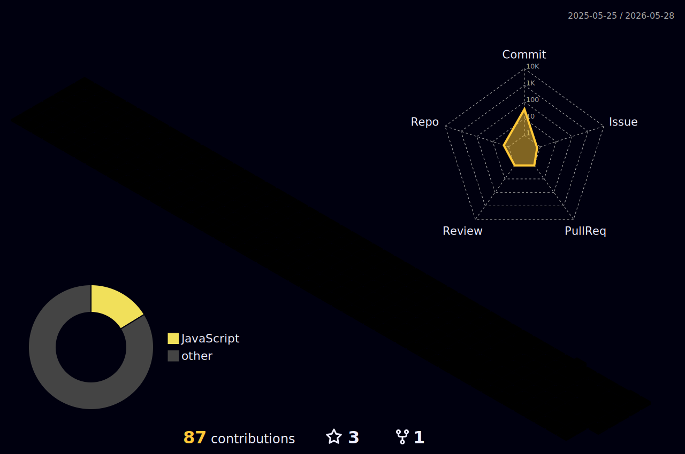

 

---

## 🧑‍💻 My GitHub Profile

- 🔭 I'm currently working on **scalable bot automation & media streaming platforms**
- 🌱 I'm currently developing **real-time backend systems**
- 💼 All of my projects are available at **[github.com/dimitrilinds](https://github.com/dimitrilinds)**
- 📝 I regularly work on **Open Source tools and bots**
- 💬 Ask me about **Node.js, bots, streaming & system architecture**
- 📫 How to reach me: **[Instagram @DaddySueco.vu](https://instagram.com/DaddySueco.vu)**
- ⚡ Fun fact: **I usually code late at night with music on 🎵**

---

## 👥 Socials

> *Why it all works? Because you take action.*

---

## </> Tech Stack

> **Important**
> These are the tech stacks and tools I use for programming.

▶ 🌐 Languages

 

▶ ☁️ Infrastructure & Cloud

 

▶ 🗄️ Databases

 

▶ 🛠️ Tools & DevOps

 

---

## 📊 Github Stats

---

## 🌐 3D Contributions

---

*Thank you for visiting my profile! If you appreciate my work, feel free to ⭐ my repos.*

